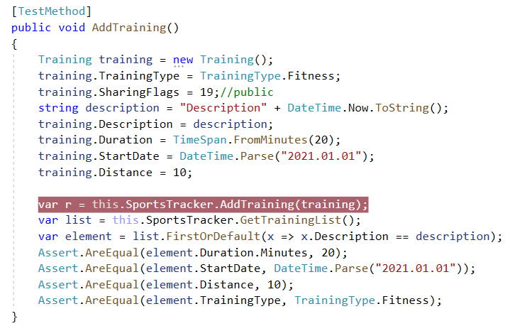

<!--Category:Powershell--> 
 <p align="right">
    <a href="https://www.nuget.org/packages/ProductivityTools.SportsTracker.SDK/"></a>
    <a href="http://productivitytools.tech/get-datename/"><a> 
    <a href="https://github.com/ProductivityTools-TrainingLog/ProductivityTools.SportsTracker.SDK"></a>
</p>
<p align="center">
    <a href="http://productivitytools.tech/">
        
    </a>
</p>

# Sports Tracker SDK
 
Library exposes methods which allow to manage trainings on the https://sports-tracker.com/ website.
<!--more-->

 ```C#
Methods
- AddTraining(Training training)
- AddTraining(Training training, byte[] gpxFile)
- AddTraining(Training training, List<byte[]> image)
- AddTraining(Training training, byte[] gpxFile, List<byte[]> image)
- AddTraining(TrainingType trainingType, string description, int duration, DateTime startTime)
- ImportGpxFile(byte[] content)
- DeleteTraining(string workoutKey)

```

To use SportsTracker you need to create it with

```c#
var sportsTracker = new SportsTracker(this.Config["login"], this.Config["password"]);
```

 
 <!--og-image-->
 
 .
